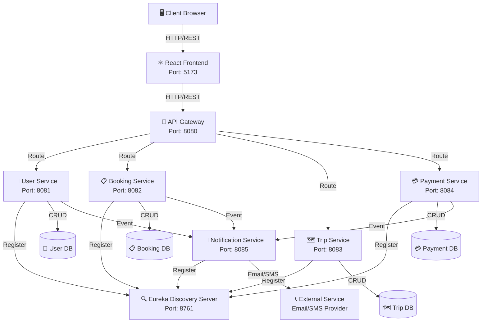
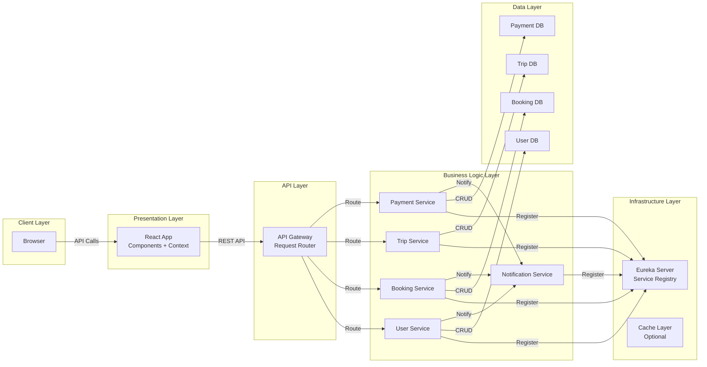
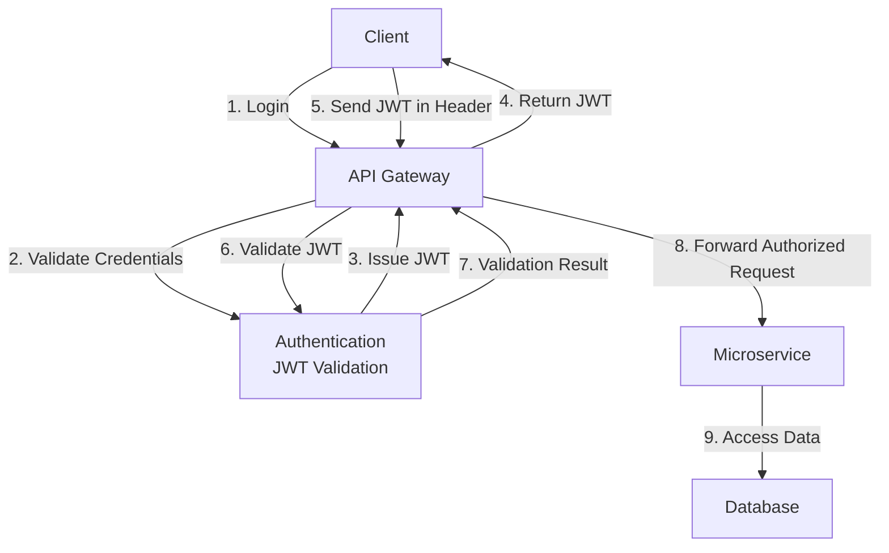

# Trip Hub - Architecture Documentation

## System Architecture Overview



## Microservices Architecture Pattern

### 1. **API Gateway Pattern**
- Single entry point for all client requests
- Routes requests to appropriate microservices
- Handles cross-cutting concerns:
  - Authentication/Authorization
  - Request/Response logging
  - Rate limiting
  - Request validation

### 2. **Service Discovery Pattern (Eureka)**
- Centralized service registry
- Services register themselves on startup
- Dynamic service discovery
- Load balancing support
- Health checking

### 3. **Database Per Service Pattern**
- Each microservice has its own database
- Data isolation and independence
- Enables autonomous scaling
- Prevents tight coupling

### 4. **Event-Driven Communication**
- Services communicate via events
- Notification service subscribes to events
- Loose coupling between services
- Asynchronous processing

## Component Interaction Diagram



## Technology Stack

### Backend Services
```
┌─────────────────────────────────────┐
│     Microservices (Java/Spring)     │
├─────────────────────────────────────┤
│ - Spring Boot 3.x                   │
│ - Spring Cloud (Eureka, Gateway)    │
│ - Spring Data JPA                   │
│ - Spring Security (JWT)             │
│ - Maven Build Tool                  │
└─────────────────────────────────────┘
```

### Frontend
```
┌─────────────────────────────────────┐
│        Frontend (React/Vite)        │
├─────────────────────────────────────┤
│ - React 18+                         │
│ - Vite Build Tool                   │
│ - Axios HTTP Client                 │
│ - React Context API                 │
│ - CSS3 Styling                      │
└─────────────────────────────────────┘
```

### Data Storage
```
┌─────────────────────────────────────┐
│      Database (MySQL/PostgreSQL)    │
├─────────────────────────────────────┤
│ - Multiple databases (one per svc)  │
│ - Relational schema                 │
│ - ACID compliance                   │
└─────────────────────────────────────┘
```

### Infrastructure
```
┌─────────────────────────────────────┐
│        Infrastructure (Docker)      │
├─────────────────────────────────────┤
│ - Docker Containerization           │
│ - Docker Compose Orchestration      │
│ - Image Registry                    │
└─────────────────────────────────────┘
```

## Data Flow Architecture

### Request Flow

```
1. Frontend sends HTTP request
   ↓
2. API Gateway receives request
   ↓
3. Gateway validates authentication (JWT)
   ↓
4. Gateway routes to appropriate service
   ↓
5. Service processes business logic
   ↓
6. Service queries/updates database
   ↓
7. If needed, service publishes event
   ↓
8. Notification Service receives event
   ↓
9. Response returned to Frontend
```

### Event Flow

```
1. Service completes operation
   ↓
2. Service publishes event (e.g., BookingCreated)
   ↓
3. Event published to event bus/queue
   ↓
4. Notification Service subscribes to event
   ↓
5. Notification Service processes event
   ↓
6. Sends email/SMS to user
   ↓
7. Stores notification record
```

## Service Communication Patterns

### Synchronous Communication (REST)
- Frontend ↔ API Gateway
- API Gateway ↔ Microservices
- Used for immediate responses

### Asynchronous Communication (Events)
- Booking Service → Event
- Payment Service → Event
- Notification Service listens to events
- Used for non-blocking operations

## Security Architecture



### Security Layers
1. **Frontend Security**
   - JWT token storage
   - Protected routes
   - HTTPS enforced

2. **Gateway Security**
   - JWT validation
   - CORS configuration
   - Rate limiting

3. **Service Security**
   - Bearer token validation
   - Authorization checks
   - Input validation

4. **Database Security**
   - Encrypted connections
   - Parameterized queries
   - Access control

## Scalability Considerations

### Horizontal Scaling
- Each microservice can be scaled independently
- Multiple instances behind load balancer
- Stateless services enable easy scaling

### Data Isolation
- Separate databases per service
- No shared database means no bottleneck
- Each service manages its own data consistency

### Caching Strategy
- Response caching at Gateway level (optional)
- Database query caching (optional)
- Frontend state management (Context API)

## Deployment Architecture

### Development Environment
```
Local Machine
├── Discovery Server (8761)
├── API Gateway (8080)
├── User Service (8081)
├── Booking Service (8082)
├── Trip Service (8083)
├── Payment Service (8084)
├── Notification Service (8085)
├── Frontend (5173)
└── MySQL Database
```

### Production Environment (Docker)
```
Docker Host
├── Container: discovery-server
├── Container: api-gateway
├── Container: user-service
├── Container: booking-service
├── Container: trip-service
├── Container: payment-service
├── Container: notification-service
├── Container: frontend
└── Container: mysql-database
```

## Performance Optimization

1. **Service-Level**
   - Database indexing
   - Query optimization
   - Connection pooling

2. **Infrastructure-Level**
   - Load balancing
   - Horizontal scaling
   - Caching strategy

3. **Frontend-Level**
   - Lazy loading
   - Code splitting
   - Image optimization
   - Browser caching

## Monitoring and Logging

### Observability Stack
- **Service Logs**: Each service logs to console/file
- **Centralized Logging**: (Optional) ELK Stack
- **Metrics**: (Optional) Prometheus + Grafana
- **Tracing**: (Optional) Distributed tracing with Sleuth

### Health Checks
- Eureka health endpoints
- Service-level health checks
- Database connectivity checks
- External service availability

---

**Version**: 1.0.0  
**Last Updated**: June 2026
