# Ease Travel - Data Flow Documentation

## Complete Data Flow Diagrams

### 1. User Registration and Authentication Flow

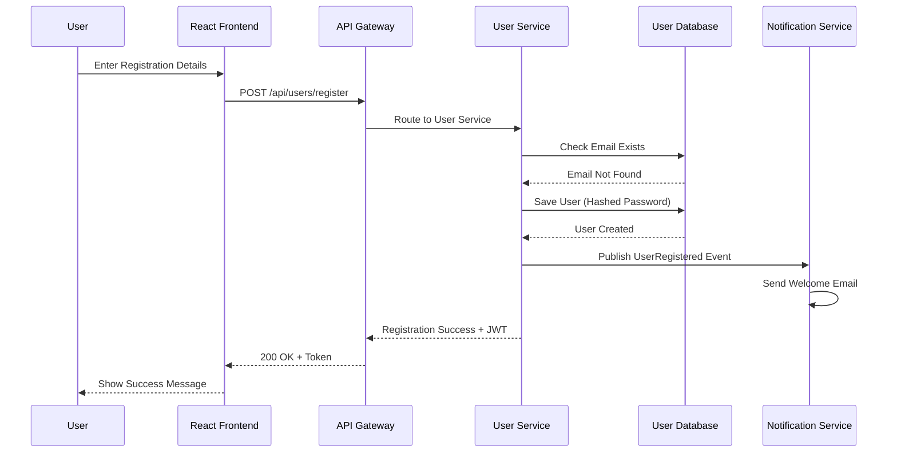

### 2. User Login Flow

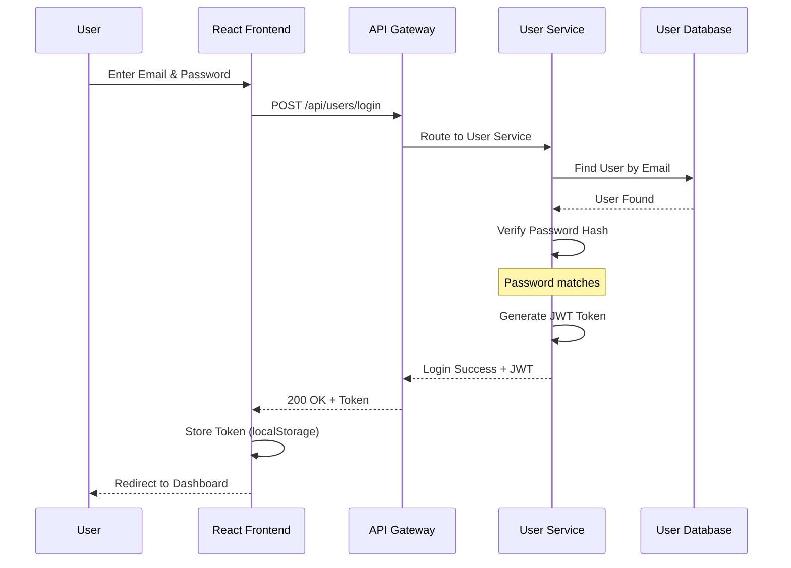

### 3. Create Booking Flow

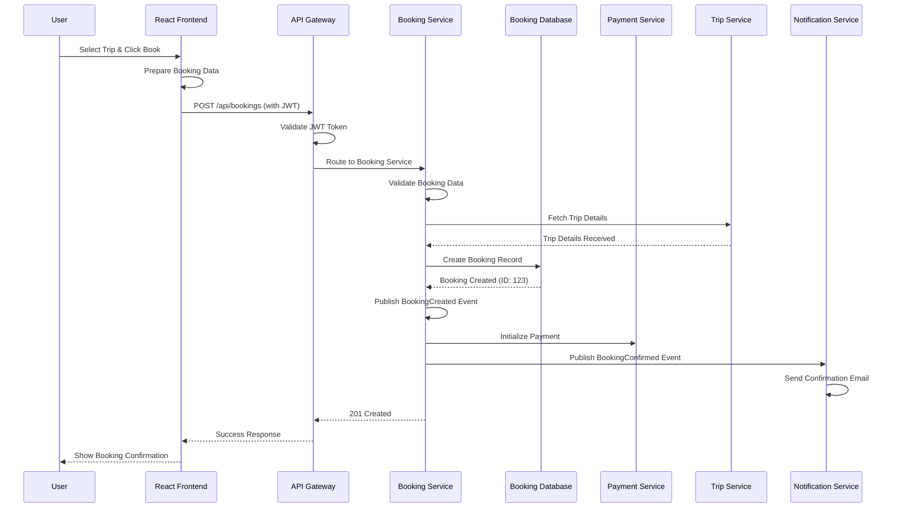

### 4. Payment Processing Flow

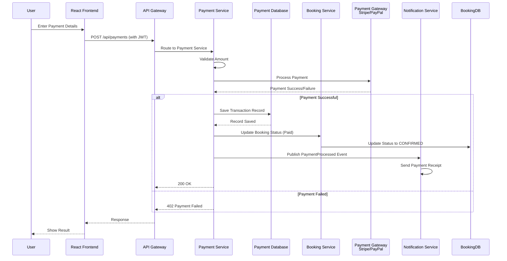

### 5. Trip Management Flow

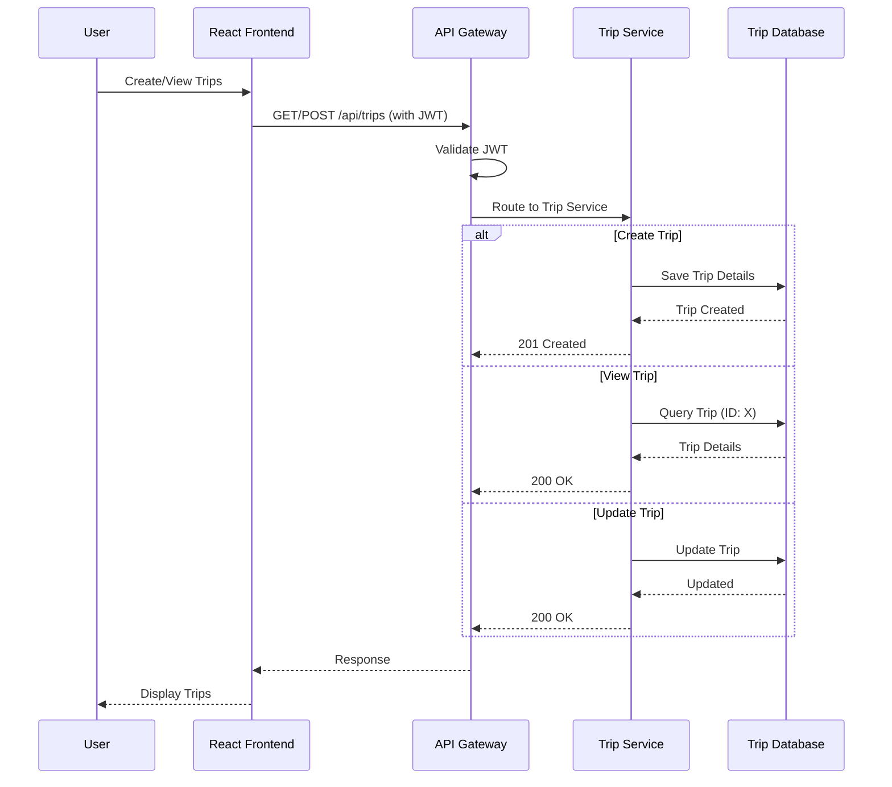

### 6. Notification System Flow

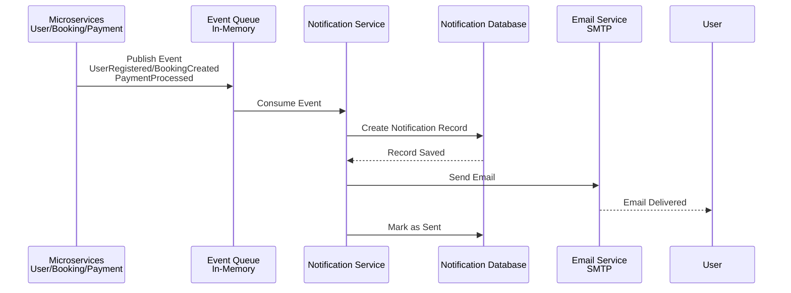

### 7. Service Discovery Flow

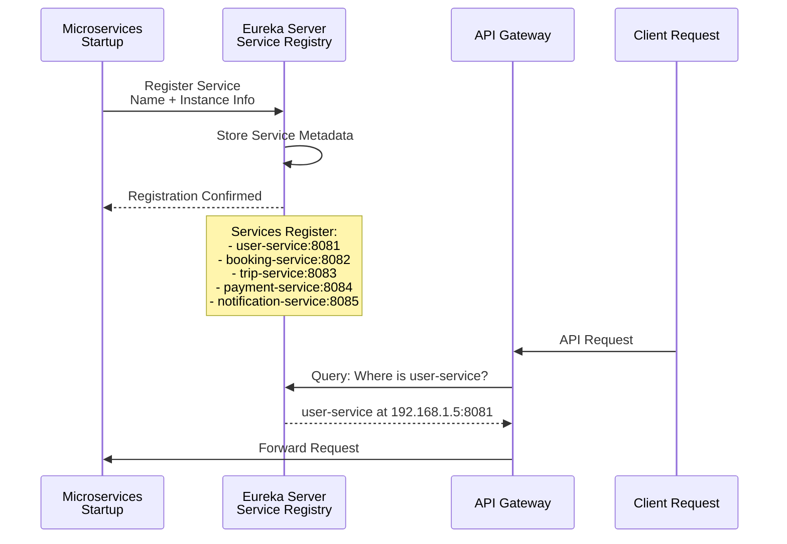

## API Gateway Request Flow

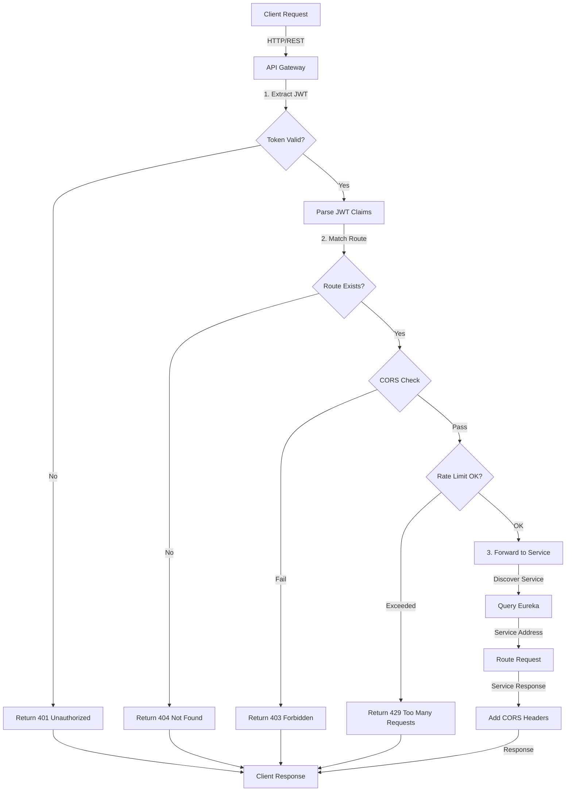

## Database Interaction Pattern

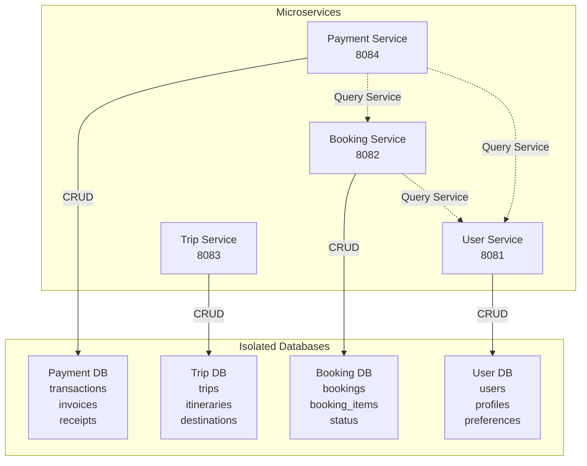

## Complete End-to-End User Journey

```mermaid
graph LR
    A["👤 User Opens App"] -->|1| B["React Frontend Loads"]
    B -->|2| C["Frontend Connects to API Gateway"]
    C -->|3| D["User Clicks Register"]
    D -->|4| E["POST /api/users/register"]
    E -->|5| F["User Service Processes"]
    F -->|6| G["Store in User DB"]
    G -->|7| H["Send Welcome Email"]
    H -->|8| I["Return JWT Token"]
    I -->|9| J["Frontend Stores Token"]
    J -->|10| K["User Logs In"]
    K -->|11| L["POST /api/users/login"]
    L -->|12| M["Verify Credentials"]
    M -->|13| N["Return JWT"]
    N -->|14| O["Redirect to Dashboard"]
    O -->|15| P["User Views Trips"]
    P -->|16| Q["GET /api/trips"]
    Q -->|17| R["Trip Service Queries DB"]
    R -->|18| S["Return Trip List"]
    S -->|19| T["User Selects Trip & Books"]
    T -->|20| U["POST /api/bookings"]
    U -->|21| V["Booking Service Creates Record"]
    V -->|22| W["Process Payment"]
    W -->|23| X["Payment Service Charges Card"]
    X -->|24| Y["Send Confirmation Email"]
    Y -->|25| Z["Display Booking Confirmation"]
```

## State Transitions

### Booking State Machine

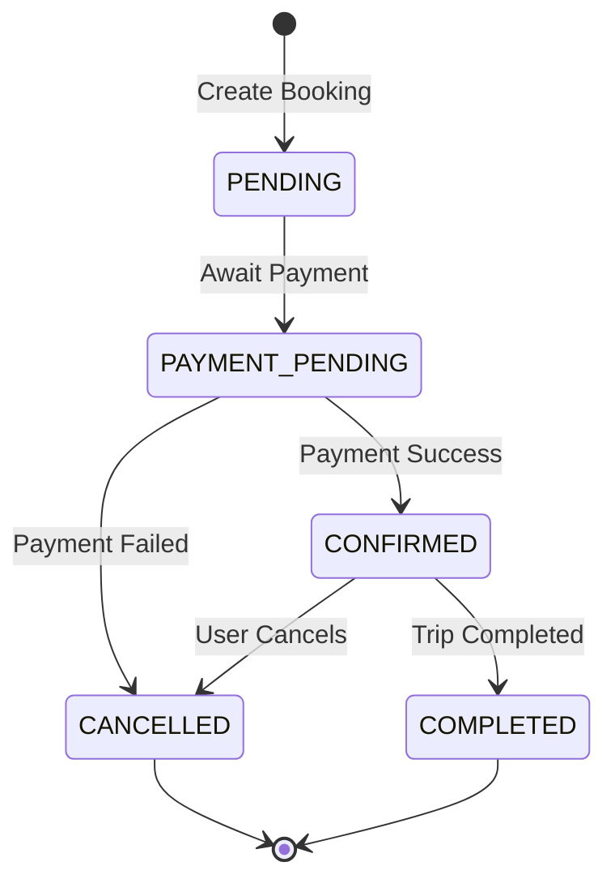

### Payment State Machine

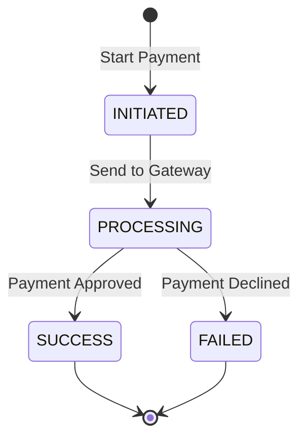

## Error Handling Flow

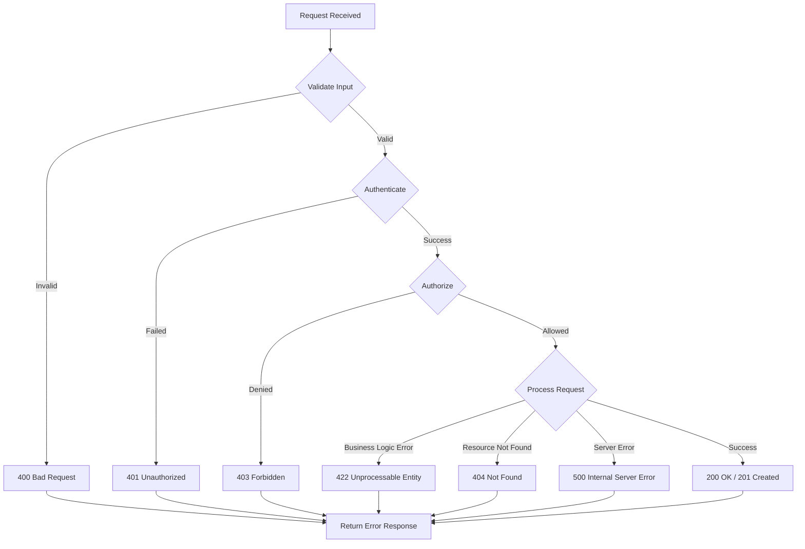

---

**Version**: 1.0.0  
**Last Updated**: June 2026
